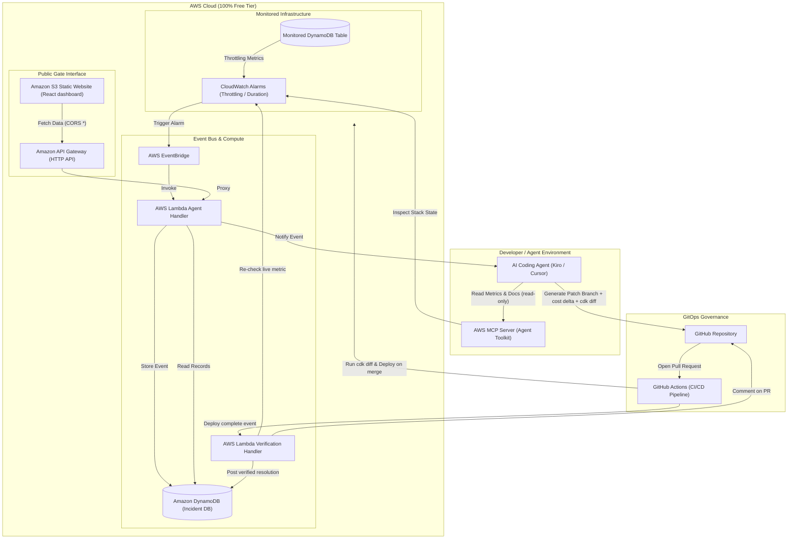
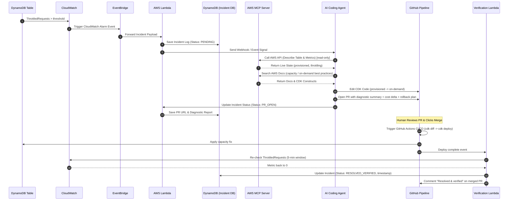

# AgentSentry AI — Complete Project Master Plan

## Executive Summary

**AgentSentry AI** is a 100% Free Tier-compliant, autonomous DevSecOps and cloud infrastructure auto-remediation copilot built for the **AWS Zero to Shipped Hackathon**.

Most "AWS incident bot" projects stop at printing a runbook or a one-click script. AgentSentry AI is different in two ways that judges can see and verify:

1. **The Pull Request is the hero, not a chatbot reply.** Every remediation is delivered as a **merge-ready GitHub PR** containing the actual CDK code change, a `cdk diff`, a **cost-delta breakdown**, and a **rollback plan**. It is reviewable, auditable, and safe by construction (human merges, never the bot).
2. **It proves the fix worked.** When the remediation PR is merged, a GitHub Actions workflow calls the verification endpoint, which re-reads the **live CloudWatch metric** and records `RESOLVED_VERIFIED` (or `FAILED`) with the observed value and a timestamp — then posts that measured outcome as a **comment on the merged PR** and shows it on the dashboard. No claim without evidence.

Two independent, judge-friendly proof layers back these claims:

- **Primary proof — the verification loop:** the live CloudWatch metric returns to healthy after the merge, with a timestamp. Proves the fix *worked*.
- **Secondary proof — CloudTrail read-only audit:** using CloudTrail **Event history** (the free 90-day record of management events — **no trail, no S3 bucket, no data events**, so it stays 100% Free Tier), we show the exact API calls the agent made during an incident are all read-only (`Describe*` / `Get*` / `List*`), never mutating. Proves the agent was *safe and only inspected*. This makes the "read-only by construction, human-in-the-loop" claim something a judge can verify in seconds rather than take on trust.

It uses the **Agent Toolkit for AWS** in two distinct places, and the distinction matters:

- **At development time:** the coding agent (Kiro) is connected to the account through the **AWS MCP Server** and was used to build, inspect and debug the system against live AWS.
- **At runtime:** the incident Lambda calls the **AWS MCP Server endpoint directly** (SigV4-signed HTTPS) to query the `aws___search_documentation` tool, so every proposed fix cites current AWS documentation. Live resource inspection itself is done with the AWS SDK (boto3) using read-only APIs.

When an incident occurs, AgentSentry AI:

- Performs a **read-only** inspection of the affected resource and its live CloudWatch metrics (`DescribeTable`, `GetMetricStatistics`).
- **Consults live AWS documentation through the AWS MCP Server (Agent Toolkit)** and cites the sources it used.
- Proposes an **Infrastructure as Code (AWS CDK)** fix by automatically opening a **GitHub Pull Request** with a diagnosis, `cdk diff`, cost delta, alternatives considered, and rollback notes.
- After the PR is merged, **re-reads the live metric** and **comments the measured outcome back on the PR**, then shows the verified resolution on a publicly accessible dashboard hosted on **Amazon S3 static website hosting**.

### Positioning: why this is not "another CloudWatch bot"

The Zero to Shipped field is crowded with autonomous-AWS-ops copilots (CloudPulse AI, CloudRescue AI, CloudLens, CloudGuard AI, DiffPulse, zombiescan, and others). AgentSentry AI deliberately competes on the two axes those projects leave open:

| Differentiator | The crowded field | AgentSentry AI |
|---|---|---|
| Remediation artifact | Text runbook / "1-click script" | Merge-ready **CDK Pull Request** with `cdk diff` + cost delta + rollback |
| Proof of outcome | "Here's what you should do" | **Re-verifies the live metric post-deploy** and posts confirmed resolution |
| Safety model | Varies / auto-apply | Human-in-the-loop by construction — bot only inspects (read-only) and proposes |
| Ship Gate | Often incomplete | Live public **S3 website URL**, 100% Free Tier |

## Category, Lane & Tagging Matrix

| Requirement | Selected Value | Justification |
|---|---|---|
| App Category Tag (pick one) | `#workplace-efficiency` | Automates DevOps incident triage and remediation, cutting investigation time to near zero. |
| Lane Tag (pick one) | `#startups` | High-value DevSecOps product addressing enterprise downtime and cloud-cost waste. (Official lane tag is `#startups`, plural.) |

> **Rules note:** Per the official Zero to Shipped rules, submissions must carry exactly **one category tag** and **one lane tag**. Using AWS CDK and open-sourcing the repo are **not required** — CDK is used here because the agent's remediation artifact is a CDK PR, and a public repo is recommended only because judges reward seeing your development process. The hard requirements are: a documented coding-agent-to-AWS connection, a live public URL (Ship Gate), an original app, category + lane, and the write-up.
| Mandatory Ship Gate | S3 static website public URL | Live, globally accessible dashboard on Amazon S3 static hosting (Amplify app limit was hit on the target account; S3 satisfies the same Ship Gate). |
| Agent Requirement | Agent Toolkit for AWS | **Dev time:** coding agent (Kiro) linked to the **AWS MCP Server** via `uvx mcp-proxy-for-aws-cli`, AWS profile `agentsentry` (account 273354655941). **Runtime:** the incident Lambda calls the same AWS MCP Server endpoint (SigV4) to query `aws___search_documentation`. |

### Live deployment (as shipped)

| Component | URL / Name |
|---|---|
| Dashboard (Ship Gate) | http://agentsentry-dashboard-273354655941.s3-website-us-east-1.amazonaws.com |
| API (Lambda + HTTP API Gateway) | https://6klp6vbzza.execute-api.us-east-1.amazonaws.com |
| GitHub repo | https://github.com/sabari-07/Agentsentry |
| Account / Region | 273354655941 / us-east-1 |

## AWS 100% Free Tier Budget Breakdown

| Service | Free Tier Limit | AgentSentry AI Usage | Projected Cost |
|---|---|---|---|
| Amazon S3 static website | 5 GB storage, 20k GET/mo (free tier) | Public dashboard hosting for judges/public evaluation | $0.00 |
| AWS Lambda | 1,000,000 requests/mo | Event processing and API backend | $0.00 |
| Amazon API Gateway | 1,000,000 REST calls/mo | REST endpoints connecting UI to Lambda | $0.00 |
| Amazon DynamoDB | 25 GB storage, 25 WCU / 25 RCU | Stores incidents, diagnostics, PR links, verification results | $0.00 |
| AWS EventBridge | Custom events free | Listens to CloudWatch alarms and stack failures | $0.00 |
| Amazon CloudWatch | 10 custom metrics, 5 GB logs | Monitors sample DynamoDB throttling / Lambda duration alarms | $0.00 |
| Agent Toolkit / MCP | Open source / Free CLI tool | Direct read-only inspection of live AWS account | $0.00 |
| AWS CloudTrail | Event history: last 90 days of management events, free to view/search/download | Read-only audit proof of the agent's API calls (no trail, no S3, no data events) | $0.00 |

## Demo Scenario (chosen to avoid the "t3.micro upgrade" cliché)

Nearly every competing project demos the same toy: EC2 CPU/memory high → upgrade instance size. AgentSentry AI uses a scenario that is realistic, serverless-native, and Free-Tier-safe:

**Primary scenario — DynamoDB throttling under load:**
1. A burst of writes trips a CloudWatch alarm on `ThrottledRequests` for the incident table.
2. AgentSentry AI inspects the table's live metrics and current CDK provisioning via MCP (read-only).
3. It cross-references AWS docs and proposes switching the table from fixed provisioned capacity to **on-demand billing mode** (or raising RCU/WCU), delivered as a CDK PR with a cost-delta table.
4. Human merges → GitHub Actions runs `cdk deploy`.
5. AgentSentry AI re-checks `ThrottledRequests` after deploy and posts **"Resolved: throttling at 0 for 5 consecutive minutes, verified <timestamp>"** to the dashboard and the PR.

**Secondary scenario (optional, if time allows) — Lambda timeout:** detects elevated `Duration`/timeout errors and proposes a memory-size increase backed by real duration percentiles.

## System Architecture & Workflows

### System Architecture Diagram



### Autonomous Remediation + Verification Execution Flow



## Step-by-Step Implementation Plan

Follow these steps chronologically to set up, build, and deploy the project.

```text
agentsentry-ai/
├── bin/
│   └── app.ts
├── lib/
│   ├── agentsentry-stack.ts
│   └── lambda/
│       ├── incident-handler.ts
│       ├── api-handler.ts
│       └── verification-handler.ts
├── dashboard/
│   ├── pages/
│   │   └── index.tsx
│   ├── package.json
│   └── amplify.yml
├── cdk.json
├── package.json
└── README.md
```

### Step 1: Initialize Project & Connect AWS Agent Toolkit

Run these commands in your local terminal:

```bash
# 1. Create directory and initialize CDK project
mkdir agentsentry-ai && cd agentsentry-ai
npx cdk init app --language=typescript

# 2. Install required dependencies
npm install @aws-cdk/aws-apigatewayv2-alpha @aws-cdk/aws-apigatewayv2-integrations-alpha
npm install aws-sdk dotenv

# 3. Authenticate AWS CLI and Configure Agent Toolkit
aws login
aws configure agent-toolkit
```

**Proof Capture:** Take a screenshot of the CLI confirmation after running `aws configure agent-toolkit`. This screenshot must be uploaded to your AWS Builder Center post as required submission proof.

### Step 2: Define Infrastructure Stack (`lib/agentsentry-stack.ts`)

Provision the monitored DynamoDB table, incident DynamoDB table, Lambda handlers (incident, api, verification), API Gateway, CloudWatch alarms on `ThrottledRequests`, and EventBridge rules — all on the AWS Free Tier.

### Step 3: Implement Lambda Incident Handler (`lib/lambda/incident-handler.ts`)

Receives the EventBridge alarm payload, writes a `PENDING` incident record, and signals the coding agent.

### Step 4: Implement Verification Handler (`lib/lambda/verification-handler.ts`)

Triggered by a "deploy complete" signal from GitHub Actions. Re-reads the live CloudWatch metric over a 5-minute window; if the incident metric has cleared, marks the incident `RESOLVED_VERIFIED` with a timestamp and posts a confirmation comment on the merged PR. This proof loop is the key differentiator — do not cut it.

### Step 5: Build Public Web Dashboard (`dashboard/pages/index.tsx`)

Next.js frontend showing three columns: **Active Incidents**, **Open PRs** (with cost delta), and **Verified Resolutions** (with timestamps). The "Verified Resolutions" column is what sets the demo apart from monitoring-only dashboards.

Add a small **"Read-Only Audit" panel** per incident that surfaces the agent's CloudTrail Event history entries (filtered to that incident's time window and IAM principal), showing every call was `Describe*` / `Get*` / `List*`. This is pulled from the free Event history — do not create a trail or S3 bucket. Presenting it cleanly (curated, filtered) is what makes it useful to a judge; a raw console dump is not.

### Step 6: Deploy the Dashboard to Amazon S3 (Pass the Ship Gate)

Build the frontend (`npm run build`) and deploy `dist/` to an S3 static website bucket using
`frontend/deploy_s3.ps1` (creates the bucket, enables website hosting, applies a public-read policy,
and syncs the build). This produces a public live URL:

```
http://agentsentry-dashboard-273354655941.s3-website-us-east-1.amazonaws.com
```

This live URL passes the Ship Gate. (An `amplify.yml` is retained in the repo for anyone who
prefers AWS Amplify hosting; S3 was used because the target account had reached its Amplify app
limit.)

**CORS note:** because the S3 site (HTTP) calls the API Gateway (HTTPS) cross-origin, the API's
FastAPI CORS is set to allow all origins (`CORS_ORIGINS=*`, configured via the Lambda environment
in the CDK stack), so the browser preflight (`OPTIONS`) succeeds.

### Step 7: AI Coding Agent Prompt Setup

Copy this prompt into your local AI coding agent (Kiro, Cursor, or Amazon Q) after running `aws configure agent-toolkit`:

```text
You are the AgentSentry AI DevSecOps Agent. Your objective is to resolve
infrastructure incident alerts from CloudWatch as a reviewable, verifiable
GitHub Pull Request. You never apply changes directly.

1. Connect to AWS via the Agent Toolkit AWS MCP Server (read-only inspection).
2. Inspect CloudWatch metrics and logs for the reported resource ID.
3. Query live AWS documentation using MCP tools to verify the correct fix and
   any capacity/billing-mode constraints for the resource.
4. Modify the CDK infrastructure code in lib/agentsentry-stack.ts to apply the
   fix (e.g., switch the DynamoDB table from provisioned to on-demand billing,
   or raise RCU/WCU; or increase a Lambda's memory size).
5. Create a new Git branch fix/agentsentry-remediation, commit the CDK change,
   and open a GitHub Pull Request that MUST include:
     - a diagnostic summary of the root cause,
     - the cost-delta breakdown (before vs. after),
     - the output of `cdk diff`,
     - a rollback plan.
6. Do NOT merge. Merging is a human action.
```

### Step 8: Post-Merge Verification (the winning moment)

When a human merges the remediation PR, the `Verify Remediation` GitHub Actions workflow fires on the
`pull_request: closed` event, extracts the incident ID from the PR, and calls the public verification
endpoint. The verification handler re-reads the live CloudWatch metric over a 5-minute window and
records `RESOLVED_VERIFIED` (or `FAILED`) with the observed value and timestamp, then **comments that
measured outcome back on the merged PR** and surfaces it on the dashboard.

This requires **no AWS credentials in CI** — the verification API is a public HTTPS endpoint. An
optional deploy job re-runs `cdk deploy` on merge, and is skipped automatically unless the
`AWS_DEPLOY_ROLE_ARN` secret is configured.

Capture this end-to-end loop (incident → PR → merge → verified resolution + PR comment) in your demo
video.

## Suggested Submission Blurb (for the Builder Center post)

> **AgentSentry AI — the AWS incident copilot that ships a reviewable fix and proves it worked.**
> Most AWS ops bots hand you a runbook. AgentSentry AI opens a merge-ready CDK Pull Request — with cost delta, `cdk diff`, and a rollback plan — then, after you merge, re-checks the live metric and posts a verified resolution. Read-only by construction, human-in-the-loop by design, 100% Free Tier, live on Amplify.

## Final Submission Checklist

- [ ] **Ship Gate Test:** Open your live AWS Amplify URL in an incognito window to verify public accessibility.
- [ ] **Agent Proof:** Attach your screenshot of `aws configure agent-toolkit` execution to your Builder Center post.
- [ ] **PR Artifact Proof:** Include a link/screenshot of a real remediation PR showing cost delta + `cdk diff` + rollback plan.
- [ ] **Verification Proof:** Include a screenshot of a `RESOLVED_VERIFIED` incident with timestamp and the PR confirmation comment.
- [ ] **CloudTrail Read-Only Proof:** Include a filtered CloudTrail Event history screenshot for one incident, showing the agent made only `Describe*` / `Get*` / `List*` calls. Confirm no trail, no S3 bucket, and no data events are enabled (stays $0).
- [ ] **Demo Video:** Show the full loop — incident fires → PR opens → human merges → metric re-verified.
- [ ] **Required Tags:** Exactly one category tag `#workplace-efficiency` and one lane tag `#startups` selected before **October 2, 2026, at 11:59 PM PT**.
